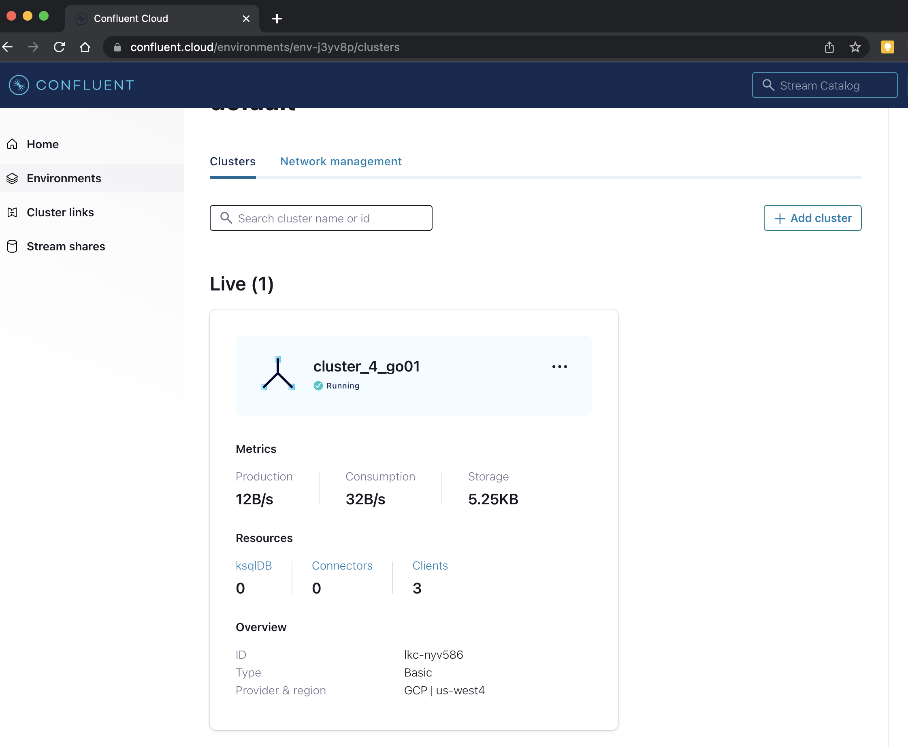
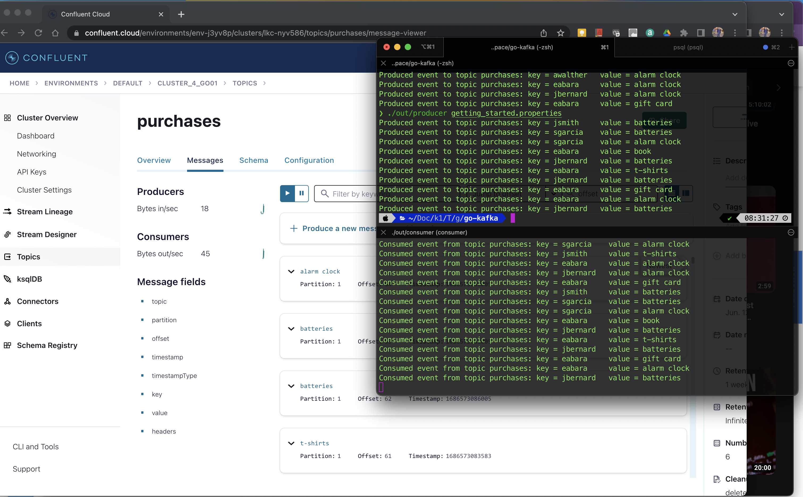
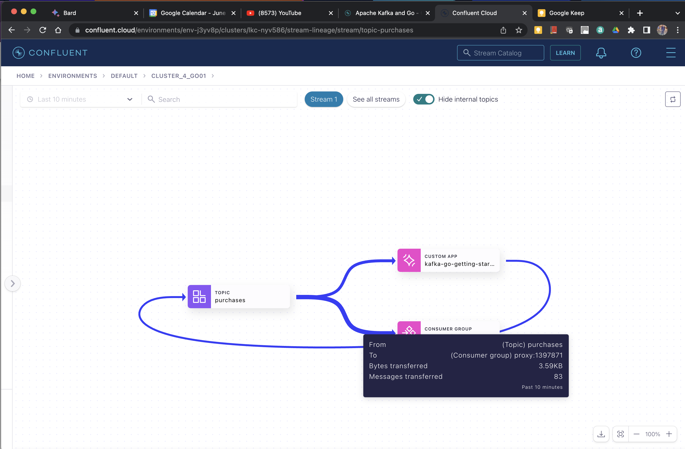

Based on a Confluent's Go Client Api Producer and Consumer:
In this tutorial, you will build Go client applications which 
produce and consume messages from an Apache Kafka® cluster.

As you're learning how to run your first Kafka application, 
we recommend using Confluent Cloud (no credit card required to 
sign up) so you don't have to run your own Kafka cluster and you 
can focus on the client development. But if you prefer to setup a 
local Kafka cluster, the tutorial will walk you through those steps.

Main Cluster setup:

Producing Messages/Events

The Architecture Configuration

